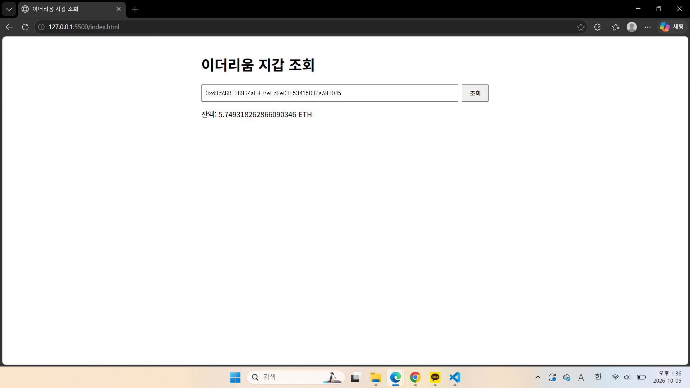
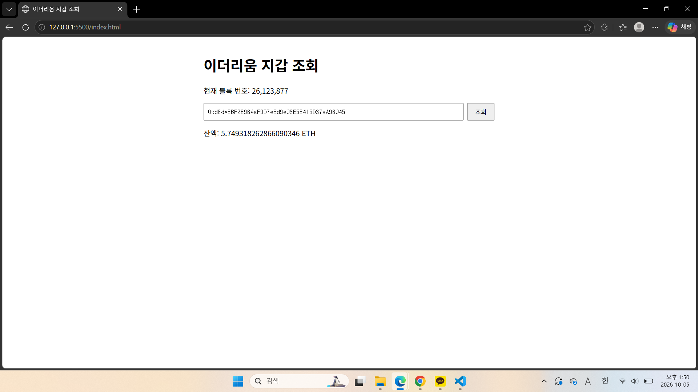
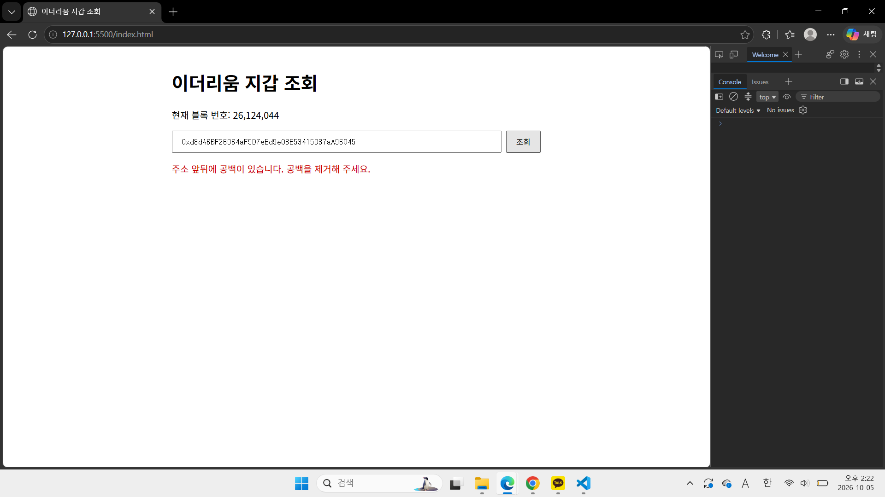
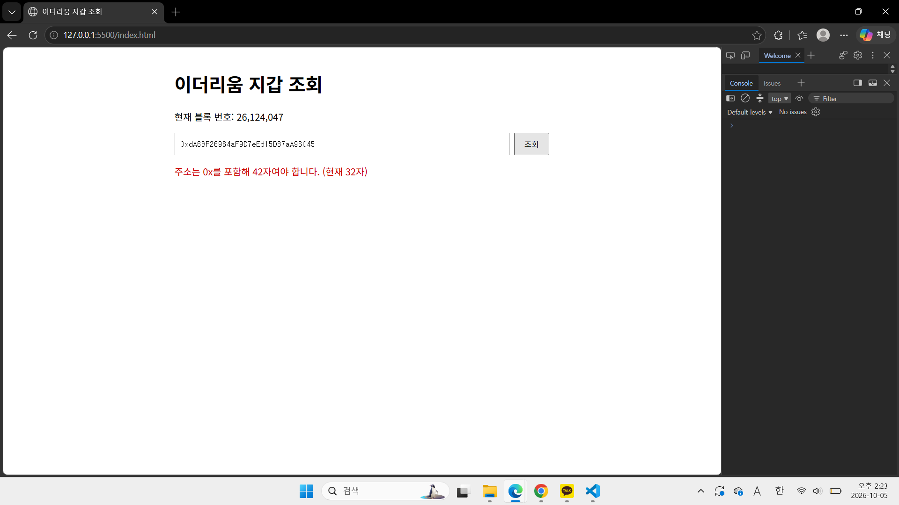
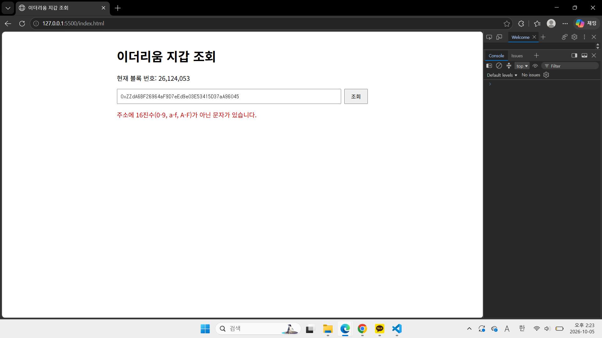
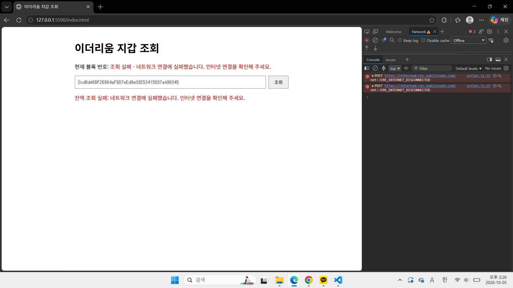
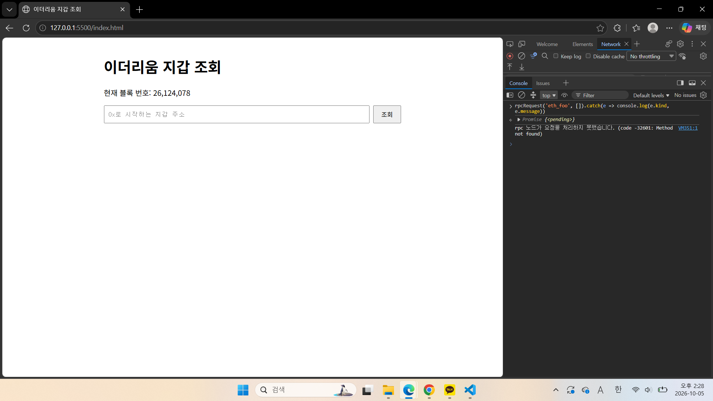
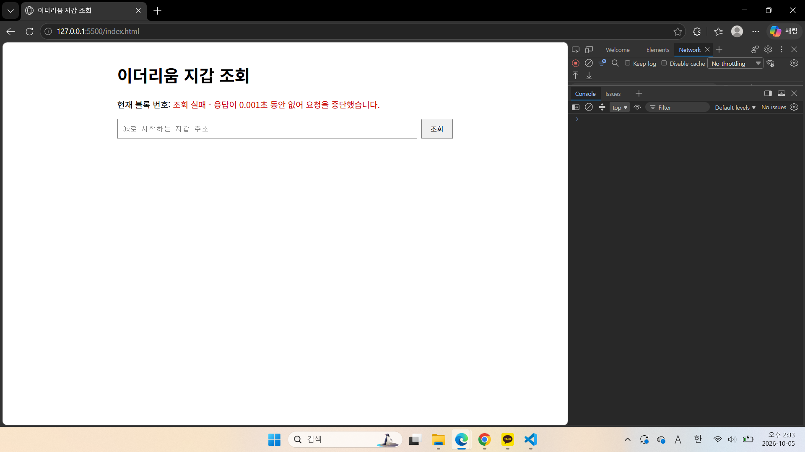
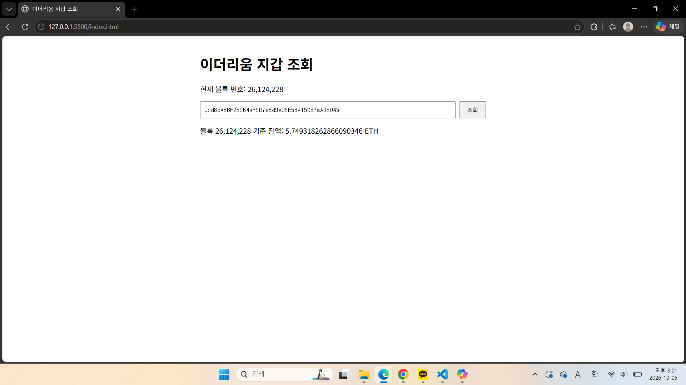

해시드오픈파이낸스 과제 시작하기

## 기능1: 주소를 입력하면 해당 지갑의 ETH 잔액 표시
지갑 주소를 입력하면 `eth_getBalance`로 해당 주소의 ETH 잔액을 가져와 보여줍니다.
응답이 wei 단위의 16진수 문자열로 오기 때문에 10진수로 바꾼 뒤 `10^18`로 나눠 ETH로 표시했습니다.
`parseInt`는 큰 값에서 끝자리가 틀어져서, 정밀도를 잃지 않도록 `BigInt`로 계산했습니다.

## 기능 2. 현재 블록 번호 표시

페이지를 열 때와 주소를 조회할 때 `eth_blockNumber`로 현재 블록 번호를 가져와 보여줍니다.
잔액과 마찬가지로 16진수 문자열로 오지만, 값이 작아 정밀도 문제가 없어서 `Number`로 변환했습니다.
요청은 기능 1에서 만든 `rpcRequest` 함수를 그대로 다시 사용했습니다.

## 기능 3. 로딩 / 오류 상태 처리

조회 중에는 "조회 중..."을 표시하고 버튼을 비활성화해 중복 요청을 막았습니다.
잘못된 주소는 요청을 보내기 전에 걸러내고, 네트워크 실패·HTTP 오류·JSON-RPC 오류·응답 지연은 각각 다른 메시지로 알려줍니다.
JSON-RPC는 실패해도 HTTP 200으로 응답하기 때문에, 상태 코드와 응답 본문의 `error`를 둘 다 확인했습니다.

- 해당 이미지들은 주소 오류를 나타내는 이미지입니다.

- 해당 오류는 네트워크를 오프라인으로 바꿨을 때 네트워크 자체 연결에 실패한 오류를 보여주는 이미지입니다. 

- 해당 이미지는 console에서 존재하지 않는 오류를 호출해서 발생한 에러 사진입니다.

### HTTP 오류 만들기
const RPC_URL = 'https://ethereum-rpc.publicnode.com/nope';

### 응답 지연 오류 
const REQUEST_TIMEOUT_MS = 1;

## 추가한 개선: 잔액과 블록 번호의 기준 맞추기

처음에는 잔액(`latest`)과 블록 번호를 따로 동시에 요청해서, 그 사이에 새 블록이 생기면 두 값의 시점이 어긋날 수 있었습니다.
돈을 보여주는 화면은 "언제 기준 금액인지"가 정확해야 한다고 생각해, 블록 번호를 먼저 받고 그 블록 기준으로 잔액을 조회하도록 바꿨습니다.
요청을 차례로 보내 조금 느려지지만, 속도보다 값의 일관성이 중요하다고 판단했습니다.
